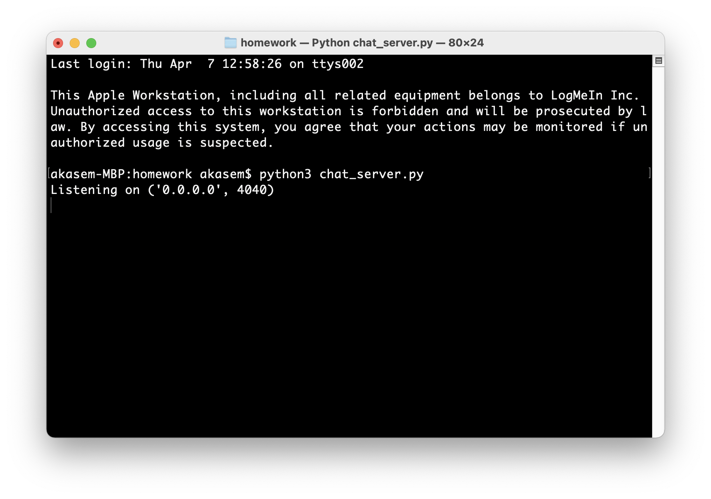
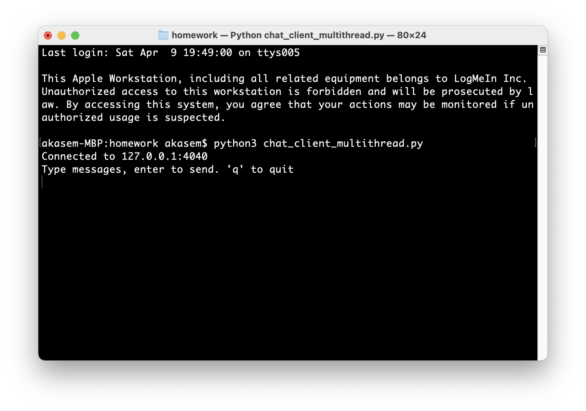
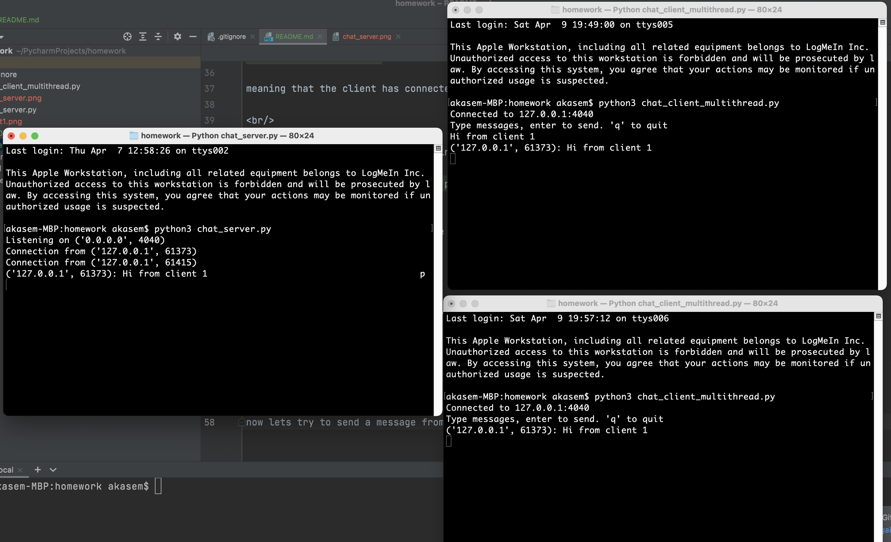
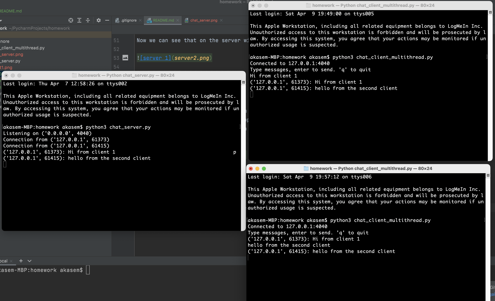

# README
## Goal
The goal of this project is to build simple chat server based on socket TCP connection and multi-threaded server

<br/>

## steps
1. Communication will be conducted over TCP.
2. The client will initiate a chat session by creating a socket connection to the server.
3. The server will accept the connection, listen for any messages from the client, and accept them.
4. The client will listen on the connection for any messages from the server, and accept them.
5. The server will send any messages from the client to all the other connected clients.
6. Messages will be encoded in the UTF-8 character set for transmission, and they will be terminated by the null byte.

## Run

open the terminal from the current directory and lunch the server using this command
```bash
python3 chat_server.py
```
<br/>
you will get a window like this:




The server now is listening to any connection on port 4040
we then let first client connect to the server, simply by running this command:
```bash
python3 chat_client_multithreading.py
```
<br/>

you will get a window like this:


meaning that the client has connected to the server directly on port 4040

<br/>

now we run a second client by running the same command again:
```bash
python3 chat_client_multithreading.py
```

we will get another window like the previous one:


<br/>

Now we can see that on the server window saying that there are 2 clients  are connected to the server together!


<br/>

## Test

now lets try to send a message from the first client to the server, lets send "Hi from client 1"
You will notice that the message appeared to the server then on the second client, meaning that the server
is working as a chat server between these 2 clients:





<br/>

now try to send a reply from the second client, lets say "hello from the second client"



You will see that the message has appeared on the server and on the first client! 
you can try to send messages as much as you want, and it will still run in this way!

<br/>

## Terminate

Our application is designed to disconnect any client from the server when the client send "q".

<br/>

#### This App is writen by students:

#### Ashraf Kasem,   Assi Almahmoud Alyousef

